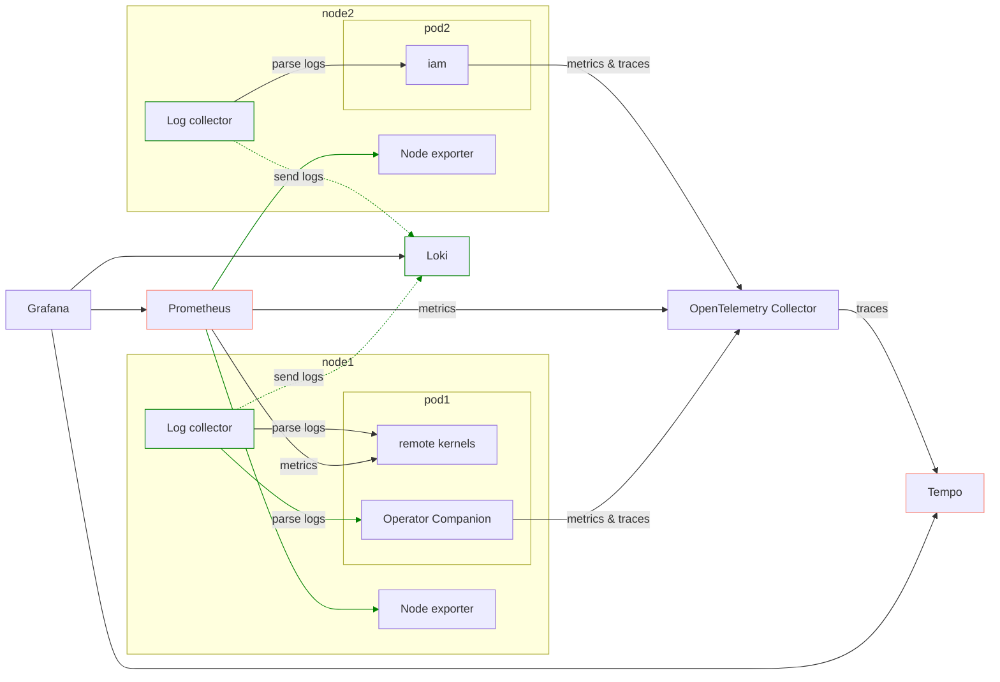

# Datalayer Observer Helm Chart

Install observability tools for Datalayer stack.

The tools used:
- OpenTelemetry Collector:
    - As deployment to proxy metrics and traces from Datalayer services to Prometheus and Tempo
    - As daemonset to parse pod log files and send them to Loki
- Prometheus: To gather metrics
- Tempo: To gather traces
- Loki: To gather logs
- AlertManager: To manage alerts
- Grafana: To visualize and analyze the telemetry

## How to install?

```
plane up datalayer-observer
```

The first time, you will likely get an error preventing the Opentelemetry collectors to
be created. Executing the `up` command a second time should pass.

If you face some issues due to the opentelemetry operator, it is likely
related to the CRDs being undefined in the cluster. You can install them
manually from `plane/etc/helm/charts/datalayer-observer/charts/crds/crds`.

> [!NOTE]
> Helm should install them the first time. But this is a complex
> thing to handle; see https://helm.sh/docs/chart_best_practices/custom_resource_definitions/#install-a-crd-declaration-before-using-the-resource

## What is deployed?

This chart is built on top of multiple subcharts:
- kube-prometheus-stack - Full Prometheus stack activating:
    - AlertManager
    - Grafana
    - Prometheus Operator
    - Prometheus
    - Prometheus Node Exporter
- loki
    - Loki as single binary
- tempo
    - Tempo as single binary
- opentelemetry-operator - using collector-contrib image

In addition to the subcharts elements, it creates:

- An opentelemetry collector as singleton instance to proxy traces and metrics from services to Prometheus and Tempo
- An opentelemetry collector as daemonset to parse the container log files and proxy them to loki
- A custom ingress for grafana to use similar config as for Datalayer services
- A service monitor to tell prometheus to fetch the metrics:
  - from the opentelemetry collector singleton
  - from the remote kernels (currently we use the Jupyter Server prometheus endpoint)
- Cluster roles for the opentelemetry collectors in order to use the Kubernetes API to fetch pod/node metadata to enrich the telemetry metadata.

> [!NOTE]
> Currently no traces are observed for the remote kernels.



## Telemetry metadata

Opentelemetry requires the services to be distinguished using a triplet (`service.name`, `service.namespace`, `service.instance.id`) - only the first one is mandatory. But
Prometheus requires services to be distinguished using a doublet (`job` or `pod`, `instance`). Therefore as recommended in Opentelemetry documentation, the following mapping is applied: `job` == `service.namespace`; `instance` == `service.instance.id`.

Those metadata are set from:
- `service.name`:
  - Enforce on telemetry send by datalayer services
  - Extracted from container name for logs
- `service.namespace`: Kubernetes namespace
- `service.instance.id`: Kubernetes pod id

The other metadata normalized (in Loki, Tempo and Prometheus) are:
- `app`: Kubernetes pod label `datalayer.io/app`
- `namespace`: Kubernetes namespace
- `pod`: Kubernetes pod name
- `cluster`: Value from `$DATALAYER_RUN_HOST`
- `instance`: Kubernetes instance

For remote kernels, the following metadata are also added:
- `datalayer.pool.name`: Kubernetes label `jupyterpool.datalayer.io/name`
- `datalayer.pool.status`: Kubernetes label `jupyterpool.datalayer.io/pod-status`
- `datalayer.pool.user`: Kubernetes label `jupyterpool.datalayer.io/user-uid`
- `datalayer.pool.type`: Kubernetes label `jupyterpool.datalayer.io/kernel-type`
- `datalayer.pool.reservation`: Kubernetes label `jupyterpool.datalayer.io/reservation-id`

## How to uninstall?

```
plane down datalayer-observer
```

> [!IMPORTANT]
> The Opentelemetry collectors will unfortunately not be removed - the associated
> CRs are failing to be deleted. You will need to edit them manually to remove the
> finalizer (as the opentelemetry operator is down). Then normally all associated
> pods should be removed.

## Tips and tricks

### Grafana

If you did not set an admin password, it was set using a random string in Kuberenetes
secret. You can get it by executing:

```
kubectl get secret --namespace datalayer-observer -l app.kubernetes.io/name=grafana -o=jsonpath="{.items[0].data.admin-password}" | base64 --decode
```

### Telemetry exploration

Grafana is the de-facto tool for exploring all telemetry (logs, traces and metrics); in particular the _Explore_ panel.

For Tempo, you can query the data using the _Search_ method and setting a _Service name_. Traces are usually not the best places to start - better use logs that will link the associated trace.

For Loki, you can query using a label filter on `service_name` (e.g. _iam_). When clicking on a log entry, you will access its metadata and a link to the associated trace (if available).

For Prometheus, you can query using a label filter on `service_name` (e.g. _iam_). It
is usually easier than starting with a metric names as those are not standardize across
services (neither in name nor in unit - that appears in the name).

### Prometheus

Prometheus gets its data source definition from CRs `PodMonitor` and
`ServiceMonitor` (recommended). Third-parties that don't support
opentelemetry metrics use such monitors and therefore are
not proxied by the opentelemetry collector. For now:
- `ServiceMonitor`: used by Grafana, AlertManager, Loki, Tempo, Prometheus, PrometheusOperator, Prometheus Node Exporter and OpenTelemetry Collector singleton.
   - To be detected by Prometheus the ServiceMonitor must have the two labels:

```
        monitoring.datalayer.io/instance: "observer"
        monitoring.datalayer.io/enabled: "true"
```

  - Kubernetes metrics are also gathered through service monitors defined in the kube-prometheus-stack.

- `PodMonitor`: used by Pulsar stack (default in helm chart).
   - PodMonitor can be defined in any namespace 
   - To be detected by Prometheus the PodMonitor must have a label `app=pulsar`. Other app name could be defined in the `kube-prometheus-stack.prometheus.prometheusSpec.podMonitorSelector`.

### Instrumentation

#### Datalayer services

The services based on connexion are instrumented explicitly using the code
defined in `datalayer_common.instrumentation` as a custom version of the
Python instrumentation ASGI was needed in particular to push the http route
metadata.

> [!IMPORTANT]
> The logging instrumentor is used as by default it calls `basicConfig`. The
> service must not call it.
Configuring the metrics and traces targets is done through environment variables:

```
export OTEL_EXPORTER_OTLP_METRICS_ENDPOINT=http://datalayer-collector-collector.datalayer-observer.svc.cluster.local:4317
export OTEL_EXPORTER_OTLP_TRACES_ENDPOINT=http://datalayer-collector-collector.datalayer-observer.svc.cluster.local:4317
```

> [!NOTE]
> Currently the data is sent using gRPC. Http is also available but would
> require to change the instrumentation code as the library to use is different.

#### Jupyter Remote Kernels

There is for now no custom instrumentation, nor custom log format. Only metrics from
the standard Jupyter Server prometheus endpoint are gathered.

##### Not working instrumentation

Auto-instrumentation by the OpenTelemetry operator
via a CR `Instrumentation` was tried but it did not work.

That CR must be defined in the namespace the pod are gonna be created and
the instrumentation will occur only at the pod creation.

A pod is selected for instrumentation if it gets some annotations. In this 
specific case, to instrument Python on a multi-container pod:


```python
    instrumentation.opentelemetry.io/inject-python: "true"
    instrumentation.opentelemetry.io/container-names: "{KERNEL_CONTAINER_NAME}"
```

> See https://github.com/open-telemetry/opentelemetry-operator?tab=readme-ov-file#opentelemetry-auto-instrumentation-injection for more information and available options (to be set through environment variables).
The Python auto-instrumentation is using http to send data to the OpenTelemetry Collector.
